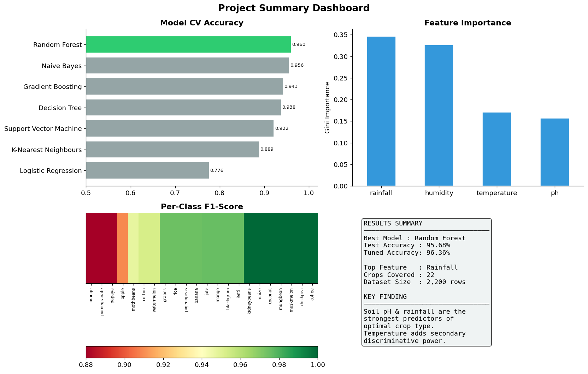
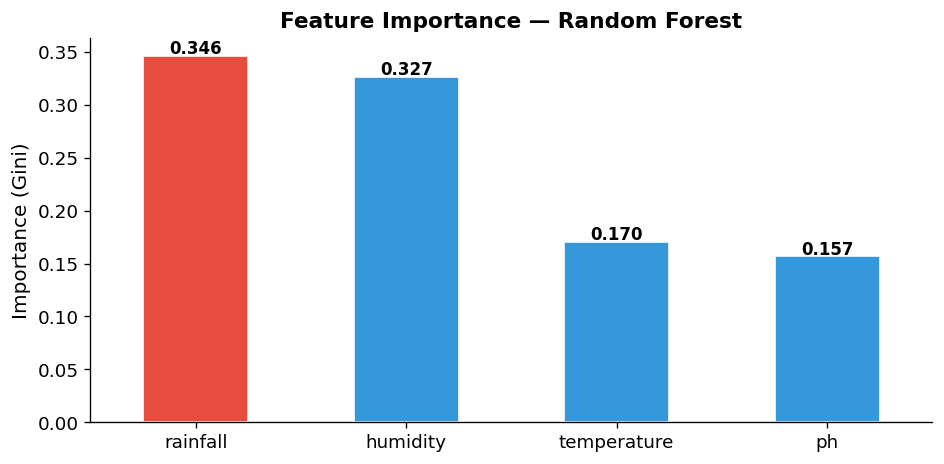
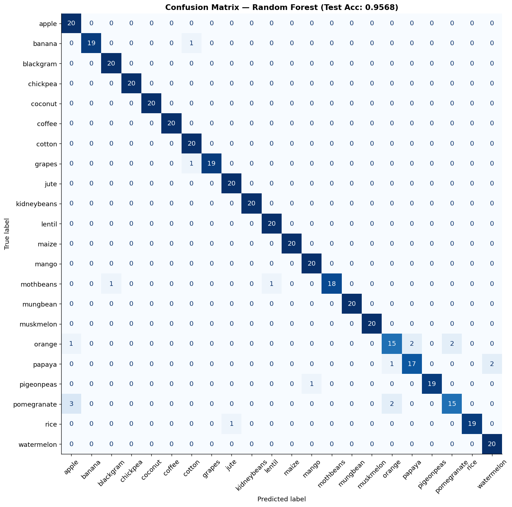
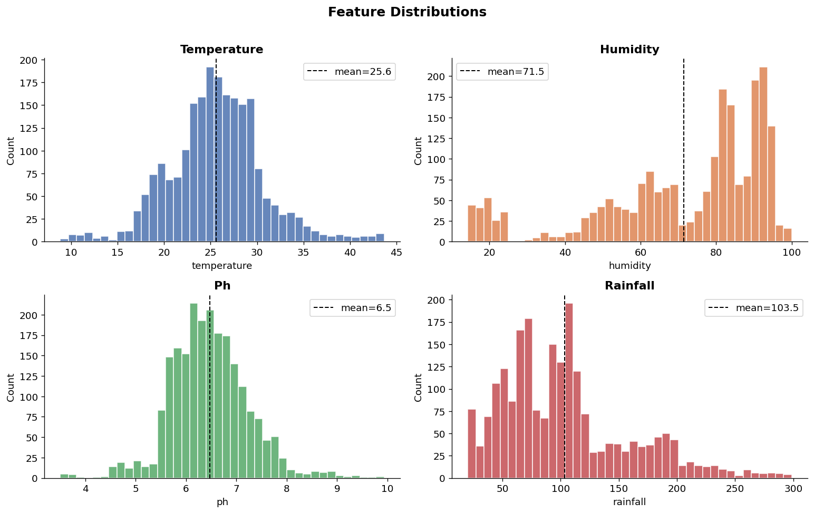
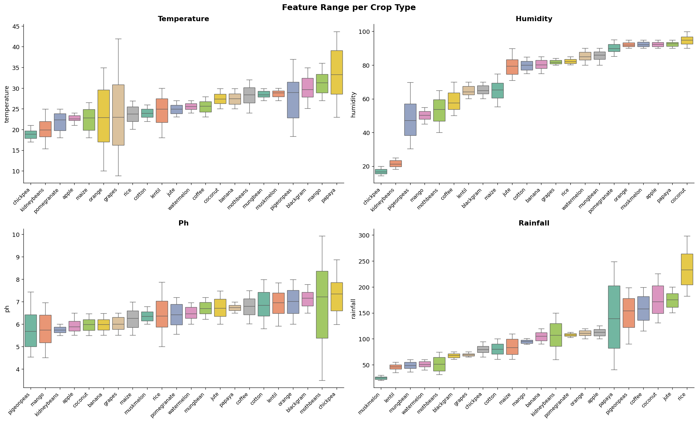
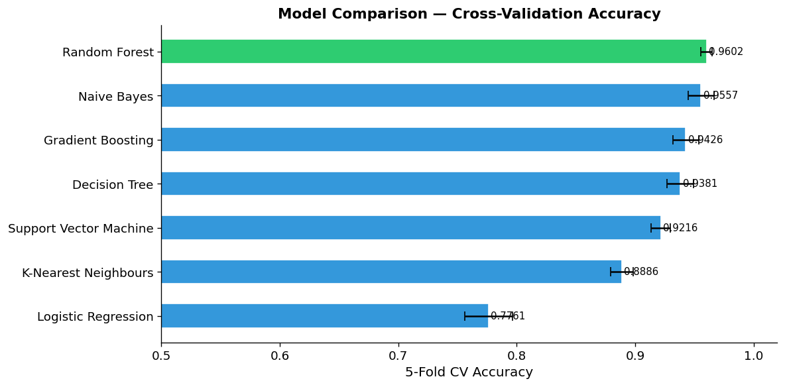
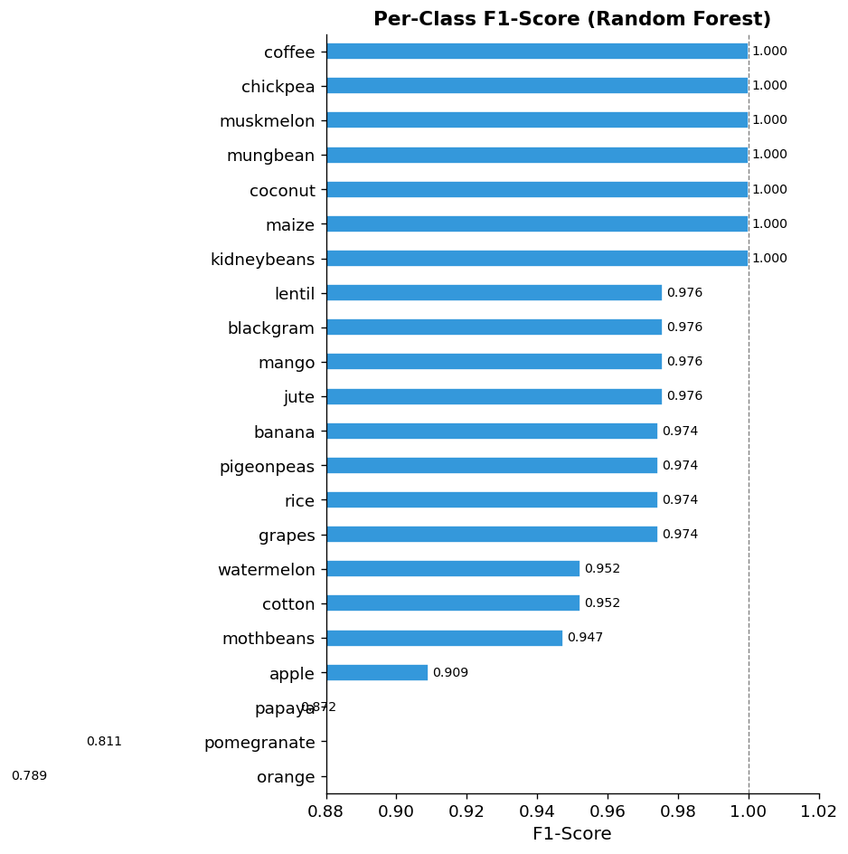

# Crop Recommendation System
**Predicting the optimal crop to grow based on soil and climate conditions**



---

## Overview
Farmers lose billions annually by planting the wrong crop for their soil and climate.  
This project builds a machine learning system that recommends the best crop given:

- Temperature (°C)
- Humidity (%)
- Soil pH
- Rainfall (mm)

The final Random Forest model achieves **95.68% accuracy** (96.36% after tuning) across **22 crop types**.

---

## Dataset
| Property | Value |
|---|---|
| Rows | 2,200 |
| Features | 4 (temperature, humidity, pH, rainfall) |
| Target classes | 22 crops |
| Class balance | Perfectly balanced (100 samples per crop) |
| Missing values | None |

---

## Results

| Model | CV Accuracy |
|---|---|
| **Random Forest** | **96.0%** |
| Naive Bayes | 95.6% |
| Gradient Boosting | 94.3% |
| Decision Tree | 93.8% |
| SVM | 92.2% |
| KNN | 88.9% |
| Logistic Regression | 77.6% |

### Feature Importance


Rainfall (35%) and humidity (33%) are the dominant predictors. Soil pH acts as the tiebreaker when water conditions are similar.

### Model Evaluation


---

## Key Charts

| | |
|---|---|
|  |  |
|  |  |

---

## Crop Recommender
The notebook includes a `recommend_crops()` function that returns ranked suggestions with confidence scores:

```
=== Tropical Conditions (25°C, 82% humidity, pH 6.5, 250mm rainfall) ===
1. rice            ███████████████████  95.5%
2. jute                                  3.5%
3. papaya                                0.5%

=== Dry/Semi-Arid (28°C, 55% humidity, pH 7.0, 60mm rainfall) ===
1. mothbeans       ████████████████     81.0%
2. blackgram       █                     8.0%
3. lentil                                4.0%
```

---

## Project Structure
```
├── data/
│   └── Crop_Data.xlsx.csv
├── Crop_Recommendation_Analysis.ipynb   # Main notebook (fully executed)
├── requirements.txt
└── *.png                                # All chart outputs
```

---

## How to Run

```bash
# Install dependencies
pip install -r requirements.txt

# Launch notebook
jupyter notebook Crop_Recommendation_Analysis.ipynb
```

---

## Next Steps
- Add NPK (nitrogen, phosphorus, potassium) soil features
- Pull live weather data via API for a given GPS location
- Deploy as a FastAPI service with a mobile frontend
- Add SHAP values for per-prediction explainability
